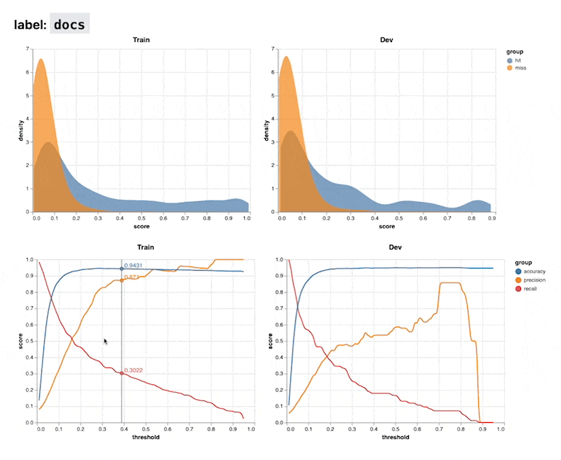

## accuraCy

> It's pronounced "accura-see". For spaCy models.

The goal of this project is to generate reports for spaCy models.

## what it does

The goal of `accuraCy` is to offer static reports for spaCy models that
help users make better decisions on how the models can be used. At the 
moment the project supports reports for threshold values for classification 
models trained with spaCy. 

Here's a preview of what to expect:



There are two kinds of charts.

1. The first kind is a density chart. This chart shows the distribution
of confidence scores for a given class. The blue area represents documents
that had the tag assigned to the class. The orange area represents documents
that didn't.
2. The second kind is a line chart that demonstrates the accuracy, precision
and recall values for a given confidence threshold. It's an interactive chart
and you can explore the values by hovering over the chart.

## install 

You can install this project via pip. 

```
python -m pip install accuracy
```

Alternatively, you may also install the latest from git. 

```
python -m pip install "accuracy @ git+https://github.com/koaning/accuracy.git"
```

## usage
The `accuracy` project provides a command line interface that can
generate reports. The full CLI can also be explored via the `--help` flag. 

```
> python -m accuracy --help

Usage: python -m accuracy [OPTIONS] COMMAND [ARGS]...

  It's pronounced 'accura-see'. For spaCy models.

Options:
  --help  Show this message and exit.

Commands:
  report   Generate a model report.
  version  Show version number.
```

The most important command is the `report` command. You'd typically use it via 
a command similar to:

```
> python -m accuracy report training/model-best/ corpus/train.spacy corpus/dev.spacy

Loading model at training/model-best
Running model on training data...
Running model on development data...
Generating Charts ━━━━━━━━━━━━━━━━━━━━━━━━━━━━━━━━━━━━━━━━ 100% 0:00:00
Done! You can view the report via;

python -m http.server --directory reports PORT 
```

This will generate a folder, typically called "reports", that contains a full 
dashboard for the trained spaCy model found in `training/model-best`. 

The CLI has a few configurable settings:

```text
Arguments:
  [MODEL_PATH]  Path to spaCy model
  [TRAIN_PATH]  Path to training data
  [DEV_PATH]    Path to development data
  [FOLDER_OUT]  Output folder for reports  [default: reports]

Options:
  --classes TEXT  Comma-separated string of classes to use
  --help          Show this message and exit.
```

